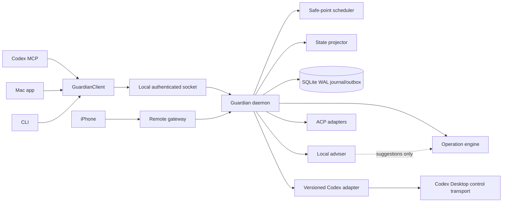

# Codex Guardian: 5X Plan

> Historical blueprint with implemented portions. For the current product contract, read [Recovery workflows](RECOVERY_WORKFLOWS.md), [Technical setup](../TECHNICAL_SETUP.md), and [Documentation map](README.md). The local daemon, journal, authenticated IPC, Mac dashboard, MCP, native recovery, safety policies, benchmark, and experimental phone foundations now exist. Unattended hard restart and production phone mutation remain unavailable because authoritative Codex Desktop control is not proven.

- Status: historical blueprint; partially implemented
- Date: 2026-07-26
Inputs: [Recovery Reliability Audit](RECOVERY_RELIABILITY_AUDIT.md) and [Alternative Agent Recovery Projects](ALTERNATIVE_PROJECTS_COMPARISON.md)

## 1. Decision

Do not merge OpenParsec and Farfield into one application.

Build Guardian as the durable recovery and control plane for the real Codex Desktop runtime:

- Official, versioned Codex app-server protocol supplies semantic truth.
- Farfield supplies the closest MIT transport/generated-schema reference.
- One launchd daemon owns state. Menu app, MCP, CLI, and phone are thin clients.
- SQLite WAL stores recovery intent and outgoing commands before side effects.
- The internal shared-client model follows AHP ideas without binding storage to its draft wire format.
- ACP adapters add other agents only after Codex recovery is proven.
- OpenParsec remains a separate, optional break-glass screen viewer.
- Apple's local model explains and drafts. Deterministic evidence owns every restart.

Paseo is the current whole-product benchmark. Do not copy its AGPL code. Guardian's first advantage is narrower and harder: safely recover the exact live Codex Desktop task without harming other work. Remote-product parity follows after that proof.

## 2. Failure theory

`Waiting for Guardian restart completion` is an ownership and evidence bug, not a missing delay.

Today:

- MCP and menu processes can act like supervisors, but neither is a durable single owner.
- State is partly inferred from JSONL tails, process existence, quiet time, and heartbeats.
- The requesting task can keep itself active and prohibit its own restart.
- State can change between safety scan and termination.
- A crash after sending continuation makes delivery ambiguous.
- Multiple tasks/callers can race, wait forever, or duplicate continuation.

Target invariant:

> One daemon owns one durable recovery transaction. It acts only on authoritative, generation-fenced state. It repairs the smallest failed component first. Desktop restarts only at a proven global safe point. Continuation completes only when the exact thread accepts the exact operation ID and starts the turn.

## 3. What “5X better” means

“5X” means five independently measured product wins, not unsupported marketing. Say “five decisive advantages” until a common public benchmark supports a numeric ratio.

| Win | Guardian target | Release evidence |
| --- | --- | --- |
| Exact recovery | Zero wrong-thread, duplicate-turn, or lost-ACK events across 10,000 deterministic replay/fault runs; zero in supervised beta | Seeded report; 100 supervised real recoveries |
| Multi-task safety | Zero global restarts while any unrelated task is unsafe or unknown | Randomized scheduler tests; impact snapshots |
| Smallest repair first | At least 80% of injected tool/MCP/thread faults recover below Desktop restart; every retry changes one meaningful variable | Fault matrix; escalation telemetry |
| Remote reliability/trust | No lost/duplicated accepted commands; consistent reconnect p95 under 2 seconds on healthy LAN/VPN; scoped, revocable devices | Sequence/reconnect/security tests |
| Local intelligence | Useful bounded summary/draft; zero model-authorized restarts, fake ACKs, or secret-bearing output | Golden-set and adversarial tests |

Two scorecards prevent fake comparisons:

- **Shared head-to-head:** reconnect, offline command reconciliation, approval handling, multi-client consistency, security controls, operator effort, and supported-agent coverage.
- **Guardian-only safety gates:** exact existing-Desktop thread recovery, global safe point, operation-ID acceptance, and crash-safe restart journal. Unsupported Paseo flows are `not available`, not competitor failures.

Statistical rule: publish trial count, environments, observation window, and confidence bound. Zero observed failures is never described as zero real-world risk. Freeze a versioned, severity-balanced fault corpus; publish per-fault-class results so easy cases cannot hide critical failures. Pin RTT, loss, VPN, warm/cold connection, and phone foreground/background conditions for remote metrics.

Comparison rules:

1. Pin exact Guardian and Paseo releases.
2. Publish harness, fixtures, machine details, and raw results.
3. Run equivalent supported flows. Mark unsupported competitor features `not available`.
4. Separate safety, correctness, latency, and feature coverage.
5. Make no “5X” speed/reliability claim unless the measured ratio supports it.

## 4. Product promise

Guardian answers:

1. What is every task doing?
2. Does anything need a person?
3. What is the smallest safe repair?
4. If Desktop must restart, can Guardian continue the exact task once and prove it?

Operator flow:

1. Observe all loaded tasks in one attention inbox.
2. Classify slow/blocked/stuck from typed evidence, never silence alone.
3. Explain evidence and propose the smallest repair.
4. Run policy-approved non-destructive repairs.
5. Show all blockers before a hard restart.
6. Journal intent, fence generation, restart, prove readiness, load target, send once, and prove acceptance.
7. Show incident, repair path, result, and rollback evidence on Mac or phone.

## 5. Scope

### Recovery Core v1

- Proven official transport into the existing Codex Desktop task.
- Durable launchd daemon and SQLite journal/outbox.
- Typed states with source, generation, time, and confidence.
- Native same-task continuation without Desktop restart.
- Global safe-point hard restart with exact one-shot continuation.
- Repair ladder, deadlines, restart budgets, circuit breaker.
- Compact macOS attention inbox and incident detail.
- MCP tools backed by the daemon.

### Remote Operator v2

- Native iPhone client.
- Live tasks and attention inbox.
- Prompt, steer, interrupt, approve, deny, reload MCP, request/cancel recovery.
- Restart-impact preview.
- Reconnect snapshots, offline queue, explicit ACKs.
- QR pairing, device scopes, revocation, audit.
- Diff, dirty-tree, and last-green-checkpoint visibility.

### Multi-agent v3

- ACP adapters and capability discovery.
- Worktree/process isolation.
- Optional AHP adapter after stabilization.
- Observe-only PTY fallback.

### Advisory Intelligence v4

- Verified-event summary.
- Failure-family and non-destructive diagnostic suggestion.
- Continuation draft.
- Restart-blocker explanation.

### Out of scope

- Replacing Codex Desktop with a new host.
- Pixel streaming as recovery authority.
- Electron patching, clipboard, Accessibility keystrokes, or TUI proof.
- `codex exec resume`.
- Public unauthenticated control port.
- Local AI deciding liveness, safety, authorization, or ACK.
- Automatic workspace rollback without policy and verified checkpoint.

## 6. Architecture



One home per decision:

| Responsibility | Owner |
| --- | --- |
| Durable lifecycle | `RecoveryEngine` |
| State classification | `TaskStateClassifier` |
| Global restart permission | `SafePointPolicy` |
| Repair ordering/retry class | `EscalationPolicy` |
| Codex translation | Versioned `CodexDesktopAdapter` |
| Desktop discovery/relaunch | `CodexProcessController` |
| Persistence/idempotency | `GuardianJournal` |
| Reconnect/sequence | `GuardianSessionHub` |
| Device authorization | `DeviceTrustStore` |
| Local-model policy | `GuardianAdvisor` |

Proposed Swift targets:

```text
GuardianDomain       pure states, events, policies, IDs
GuardianPersistence  SQLite migrations, journal, outbox, leases, budgets
GuardianCodex        generated schemas and Desktop adapters
GuardianDaemon       single writer, scheduler, repair engine, APIs
GuardianClient       typed client for Mac, MCP, CLI, future iOS
CodexGuardian        compact macOS UI
CodexGuardianMCP     MCP-to-daemon adapter
```

Use GRDB behind `GuardianJournal` for migrations, transactions, pooling, and WAL. Domain logic stays independent of it. Clients never duplicate policy.

`CodexProcessController` resolves Desktop by bundle identifier through LaunchServices, verifies signing identity/bundle URL, and tracks PID plus process start identity and process epoch. Never hardcode `ChatGPT.app`.

## 7. Gate 0: prove the Desktop control path

This gate comes before daemon or phone work. Do not assume the live Desktop IPC path equals upstream documentation.

Build a protocol laboratory using the Codex binary bundled inside the installed Desktop app.

Required proof:

1. Detect installed Desktop and bundled Codex versions.
2. Handshake without starting a detached replacement host.
3. Prove the connection belongs to Desktop's exact process/session—not another app-server or proxy host.
4. Prove Desktop UI stays synchronized after Guardian connects/disconnects and that multi-client framing is supported.
5. List the same threads visible in Desktop.
6. Observe a real Desktop turn from `turn/started` to terminal state.
7. Observe approvals/input and MCP startup state.
8. Prove workload inventory completeness across loaded/unloaded activity, automations, subagents, and owned terminals.
9. After all read-only proofs pass, send a unique message ID to a chosen existing Desktop thread.
10. Prove that exact message appears in that exact Desktop thread and starts a turn.
11. Disconnect after send bytes/before reply; restart Desktop; reload thread; recover the same message ID/turn without resend.
12. Reconnect without losing sequence or creating a second subscriber state.
13. Generate checked-in adapters during development/CI from pinned binaries. Runtime only negotiates capabilities and selects a known adapter.

Red first:

- A separate app-server instance fails the “same Desktop task” assertion.
- Wrong-thread acceptance fails.
- Unsupported schema becomes observe-only.
- Sequence gap requires a full snapshot.
- Disconnect rejects in-flight requests by deadline.
- Unknown/partial workload inventory disables automatic hard restart.
- Renamed app, beta/stable installs, PID reuse, signature mismatch, and missing app fail safely.

Exit gate:

> Exact read and exact write against the live Desktop task are proven. Otherwise stop. Keep the current native queued path, request an upstream protocol capability, and do not hide the gap with UI automation.

If `clientUserMessageId` does not survive ambiguous disconnect plus Desktop restart, disable direct daemon delivery. Keep the native same-thread queue until upstream supplies durable correlation.

## 8. Authoritative state

Every observation has `source`, `observedAt`, `serverGeneration`, `eventSequence`, `confidence`, and `expiresAt`.

Every adapter also reports workload inventory as `complete`, `partial`, or `unavailable`. Anything except `complete` makes global safety `unknown`.

Evidence order:

1. Supported Codex lifecycle and unresolved server requests.
2. Guardian-owned process/operation events.
3. OS startup/liveness evidence.
4. Filesystem logs for diagnostics only.
5. UI, terminal, quiet time, and AI inference never authorize destruction.

| State | Meaning | Automatic Desktop restart? |
| --- | --- | --- |
| `working` | Active turn with fresh progress | No |
| `waiting_user` | Approval, auth, permission, or question open | No; notify |
| `slow` | Responsive control plane; beyond soft deadline | No; diagnose |
| `stuck` | No pending input; hard deadline plus failed progress/control evidence | Policy only |
| `idle` | Loaded; no turn or owned background work | Eligible |
| `finished` | Terminal; no queue/background work | Eligible |
| `recovering` | Fenced operation owns task | Owner only |
| `unknown` | Stale, conflicting, disconnected, or unsupported | No; fail closed |

Rules:

- Silence alone never means stuck.
- Quiet compiles, downloads, tools, and subagents may be healthy.
- Ignore only the verified recovery heartbeat for its exact origin operation.
- Real resumed work in that thread blocks again.
- A stale/missing global snapshot blocks destructive recovery.

## 9. Durable data

Store SQLite in a `0700` user Application Support directory, database mode `0600`, WAL enabled. Use per-operation envelope keys protected by a Keychain-held parent key. Destroy the operation key after ACK. Checkpoint/truncate WAL and document that physical deletion on SSD storage is best-effort.

| Table | Essential fields | Purpose |
| --- | --- | --- |
| `operations` | ID, kind, origin, state, owner, generation, deadlines | Recovery transaction |
| `operation_events` | operation ID, index, type, evidence, result, time | Append-only audit/replay |
| `task_snapshots` | thread, state, source, generation, sequence, confidence, expiry | Authoritative projection |
| `outbox` | operation/message IDs, target, encrypted payload, send/ACK state | Durable delivery |
| `leases` | resource, owner, generation, expiry | Single writer/fencing |
| `restart_budgets` | scope, attempts, window, cooldown, circuit | Durable throttle |
| `devices` | identity, capabilities, status, last seen | Remote trust |
| `client_sessions` | client, last ACK sequence, generation | Reconnect |
| `incidents` | failure class, changed variable, evidence, result | Learned correction trail |

Invariants:

1. Persist intent before side effect.
2. One operation ID spans MCP, Mac, phone, and Codex message.
3. One active lease owner; generation fences stale owners.
4. State transition and outbox mutation share one transaction.
5. Ambiguous sends search the target thread for the operation ID before resend.
6. Corrupt rows isolate; filesystem/database uncertainty fails closed.
7. Replay never repeats a completed unsafe side effect.
8. A hard-restart operation stores expected bundle identity, signing identity, PID, process start identity, and server generation. Compare-and-swap these immediately before termination.

## 10. Recovery protocols

### Native same-task recovery

Use while Desktop/control plane is responsive.

```text
requested -> target_verified -> continuation_queued -> delivery_receipt
          -> monitoring -> acknowledged | waiting_user | failed | timed_out
```

1. Create operation UUID.
2. Resolve/verify origin thread.
3. Persist encrypted continuation and outbox row.
4. Send with `clientUserMessageId = operation UUID`.
5. Match exact thread, message item, and `turn/started`.
6. Record delivery receipt after exact thread + exact message ID + matching turn ID + `turn/started`.
7. Release continuation ownership at delivery receipt. Route later progress, approval, terminal failure, or timeout into normal monitored task state.
8. ACK recovery after the first assistant/tool/plan event or terminal outcome; otherwise time out into a visible incident/dead letter.
9. Destroy the operation content key after ACK/dead-letter review.

No restart. No heartbeat. No clipboard. No latest-thread guess.

### Hard Desktop recovery

Use only after proving Desktop unhealthy and exhausting smaller repairs.

```text
prepared -> globally_gated -> restart_issued -> desktop_started
         -> control_ready -> schema_ready -> plugins_ready -> target_loaded
         -> continuation_sent -> delivery_receipt
         -> monitoring -> acknowledged | waiting_user | failed | timed_out
```

1. Persist operation/prompt.
2. Acquire renewable, generation-fenced lease.
3. Snapshot every task, unresolved request, queue, and owned worker.
4. Classify all state and show impact.
5. Re-read generation immediately before termination.
6. Persist `restart_issued` before termination.
7. Prove startup, handshake, schema, capability readiness, and target load separately. Persist required/optional/degraded capabilities per operation; optional MCP failure cannot create an infinite wait.
8. Send through durable outbox.
9. Reconcile ambiguous disconnect before resend.
10. Release restart ownership after exact delivery receipt. Later progress/approval/failure follows monitored task policy.
11. Dead-letter visibly when policy exhausts. Never silently loop.

### Legacy migration

Keep the automation heartbeat only until Gate 0 delivery passes:

- Require exact origin token/thread.
- Delete heartbeat before ACK; pausing is not cleanup.
- Ignore only that heartbeat turn during quiet gating.
- Name the actual blocker instead of generic waiting.
- Remove heartbeat after equivalent fail-first proof.

## 11. Safe-point scheduler

```text
stale snapshot, sequence gap, unsupported schema, conflicting evidence -> unknown; block
unsafe unrelated task -> block and explain evidence
real resumed work in requester -> block
only verified requester heartbeat -> ignore that turn
generation changed since classification -> discard and resnapshot
budget open and readiness prerequisites available -> issue one fenced restart
otherwise -> open circuit; require human reset
```

Final safety barrier runs inside the same serialized adapter actor:

1. Subscribe and buffer new events.
2. Take the authoritative snapshot.
3. Replay buffered events and classify.
4. Drain once more immediately before termination.
5. Compare expected process identity/generation and terminate only on match.

Red-race `turn/started` between snapshot and termination. If Codex exposes no quiesce/CAS primitive that closes the final race, document the residual risk and require fresh Mac confirmation for hard restart.

Fairness:

- Queue by priority then age.
- One global restart operation at a time.
- Aged requests become visible incidents, never forced restarts.
- Cancellation is durable and fences late owners.
- **Force Restart Now** remains human-only with impact warning/audit.
- Force restart is Mac-local in v1. Remote clients may request policy-approved recovery but never bypass active/unknown gates.

## 12. Repair ladder

1. Classify: tool, MCP host, app-server/control, thread, Desktop, permission, disk, network, external dependency.
2. Retry once only for evidence-backed transient failure, with jitter/deadline.
3. Reload/reconnect affected MCP or tool host.
4. Steer/interrupt only the affected turn.
5. Reconnect control plane; restart only Guardian-owned child.
6. Restart Desktop at a proven global safe point.
7. Open circuit after bounded failures; show reset and evidence.

Record exact symptom, failure class, missing proof, changed variable, result, and next allowed time. Policy/test forbids unchanged deterministic retry.

## 13. Client and remote protocol

Use a Guardian protocol versioned independently from storage and Codex.

Server-authoritative rules:

- Full snapshot contains generation and last event sequence.
- Events are immutable and ordered.
- Commands contain operation ID, client ID, expected generation, and deadline.
- UI shows pending until server echo/ACK.
- Sequence gap/generation change forces full snapshot.
- Disconnect rejects in-flight RPCs locally but retains durable queued commands.
- Reconnect reconciles operation ID before resend.

Local transport:

- Unix-domain socket inside user Application Support.
- `0600` permissions plus client authentication. Same UID is only peer filtering.
- Distinct Mac UI, MCP, CLI, and remote-gateway roles/capabilities.
- Prefer launchd Mach service/XPC audit-token and code-signature validation where practical; otherwise use install-bound Keychain credentials.
- Bind MCP recovery capability to its verified origin thread. MCP never gets force-restart authority.
- No network listener by default.

Remote transport:

- Opt-in TLS 1.3; private VPN/Tailscale path preferred.
- QR pins Guardian identity and consumes a one-time pairing nonce.
- Device identity/key lives in Keychain.
- Remote capabilities separate observe, prompt, approve, repair, policy-approved hard restart, files, and terminal.
- Remote devices never receive force-restart bypass capability. A future remote force flow requires fresh Mac confirmation and phone biometric reauthentication.
- Revocation closes active sessions immediately.
- Push carries opaque incident IDs only—no prompts, diffs, paths, or secrets.
- Rate limits, replay protection, nonce expiry, audit, and rotation are release blockers.

## 14. Mac and iPhone experience

One compact model on both devices:

### Attention

- Needs approval
- Needs answer
- Suspected stuck
- Recovery waiting
- Recovery failed

### Active

- Task, workspace, turn, last verified progress
- Owned tools/subagents/background work
- Safe actions available now

### Recent

- Completed turns
- Recovery incidents
- Exact repair path/proof

Only show supported actions: prompt, steer, interrupt, approve/deny, retry changed action, reload MCP, native/hard recovery, cancel, impact, diff/checkpoint.

Hard-restart detail must show requester, blockers/reasons, evidence age/generation, smaller repairs tried, budget/circuit, continuation target, and force-restart impact.

OpenParsec stays a separate break-glass launch action. Normal recovery needs no terminal or raw screen.

## 15. Smart Guardian

Apple's local model is an adviser behind a hard policy boundary.

Allowed input:

- bounded verified events;
- sanitized failure/repair history;
- redacted diff summary;
- deterministic state/blockers.

Strict output:

```swift
struct GuardianAdvice: Codable {
    let summary: String
    let likelyFailureFamily: FailureFamily
    let suggestedDiagnostic: DiagnosticKind?
    let continuationDraft: String?
    let uncertainty: String
}
```

Forbidden:

- executable tool calls or state mutation;
- choosing restart safety or overriding `unknown`;
- authorizing/simulating ACK;
- credentials, tokens, or raw private content;
- dependency on model availability.

Fallback: deterministic templates. Core recovery works unchanged without AI.

Golden cases: stuck tool, approval, missing MCP, permission failure, healthy compile, network outage, disk full, unsupported schema, ambiguous send, multiple tasks, prompt injection in logs/diffs, secret-like strings, forced-restart request, and insufficient evidence.

Blind scoring measures factual grounding, correct blocker identification, continuation usefulness, operator edit distance, latency, refusal under insufficient evidence, and secret-redaction false negatives. Publish the rubric and held-out-set size.

## 16. Test strategy

No implementation patch before the observed symptom has a red regression. No build N+1 ships until the prior production symptom fails without its fix.

| Layer | Purpose |
| --- | --- |
| Pure policy | State, safe point, escalation, budgets |
| Persistence | Transactions, migrations, leases, corruption, disk faults |
| Protocol contract | Schema, versions, order, ACK correlation |
| Fake app-server | Deterministic turns, approvals, reconnect |
| Journal replay | Crash around every transition |
| Seeded chaos | Races, duplicates, reordering, stale owners, PID reuse |
| Real Desktop | Visible-thread identity, send, readiness, exact continuation |
| Security | Pairing, scope, revocation, replay, redaction, peer identity |
| UI | Blocker explanation, pending/offline, destructive confirmation |

Mandatory red regressions:

1. Recovery heartbeat cannot self-block forever.
2. Real resumed requester work blocks restart.
3. Unrelated active task blocks restart.
4. Approval/MCP authentication becomes `waiting_user`.
5. Quiet progressing tool is not `stuck`.
6. Stale generation invalidates safe decision.
7. Sequence gap blocks until snapshot.
8. Crash at each journal edge resumes safely.
9. Crash after send/before ACK creates no second turn.
10. Duplicate MCP/phone callers share operation/owner.
11. Lease expiry fences stale process.
12. Disconnect fails pending calls by deadline.
13. Wrong thread/message ACK fails closed.
14. Corruption, disk full, permission loss, unsupported schema fail safely.
15. Restart budget survives daemon/machine restart.
16. Successful tool reload prevents Desktop restart.
17. Local model cannot invoke restart or alter state.
18. Device revocation stops a live session.
19. Offline resend reconciles before duplicate action.
20. Dirty worktree/unowned process appears in impact.
21. Corrupt item isolation does not hide queue-I/O fail-closed behavior.
22. Abandoned lease lock returns a bounded busy error.
23. Repeated origin token is idempotent; conflicting reuse fails closed.
24. Paused/wrong-thread heartbeat ACK fails closed.
25. New app-server identity plus required settle/readiness is proven.
26. Automation ID cannot escape its state directory.
27. Crash after `restart_issued` before kill cannot terminate a new process; PID reuse is fenced.
28. Malicious same-UID caller and cross-thread confused deputy are rejected.
29. Context-mode absent or optional startup failure becomes a named degraded/blocked capability, never generic waiting.

Fault matrix: daemon kill, Desktop crash, control disconnect, event gap/reorder/duplicate, stale generation, slow/hung RPC, PID reuse, corrupt row, permission removal, disk full/read-only disk, sleep/wake/clock change, network loss, key revocation, unsupported Codex version, and two active real tasks.

## 17. Observability and privacy

Categories: `state`, `protocol`, `operation`, `scheduler`, `repair`, `restart`, `outbox`, `remote`, `security`, `advisor`.

Each event has timestamp, operation ID, task pseudonym, generation, sequence, phase, and result. Exclude prompt text, tool output, file content, credentials, tokens, and personal paths by default.

Dashboard shows state age/source, operation phase/deadline, blockers, changed repair variable, restart budget, outbox state, adapter compatibility, and paired-device audit.

Default retention:

- operational metadata: 30 days;
- continuation payload: delete after ACK/dead-letter review;
- raw diagnostic export: explicit action only;
- one-click purge and device revocation.

## 18. Security, release, licensing

Security gates:

1. Threat-model local socket, pairing, malicious thread content, compromised phone, replay, confused deputy, and updates.
2. Scan secrets/personal paths before every public release.
3. Sign/notarize macOS artifacts; verify launchd ownership/update integrity.
4. Fuzz protocol decoding and migrations.
5. Audit every destructive action/authorization.
6. Unsupported Codex version is observe-only.
7. Force restart remains human-only and visibly dangerous.

License rules:

- Guardian stays PolyForm Noncommercial: public source-available, not OSI open source.
- Record source, license, commit, adopted files/patterns, and notices.
- Prefer MIT/Apache references.
- Paseo/Codexia AGPL remains behavioral/documentation reference only. No copying, linking, vendoring, or service integration without explicit license review; process separation alone does not settle obligations.
- OpenParsec GPL code remains separate pending legal review.
- Scan tokens, private URLs, usernames, absolute paths, signing identities, and artifacts before GitHub publication.

Engineering guidance only; not legal advice.

## 19. Delivery plan

Estimate: one primary engineer using Codex, with focused reviews. Independent work may overlap. Exit gates may not.

Every named regression from both input audits belongs in the Phase 0 traceability matrix and CI release manifest.

### Phase 0 — Evidence and benchmark baseline (2–3 days)

Red first:

- Current self-blocking/waiting symptom fixture.
- Wrong-thread and duplicate-continuation negative fixtures.

Build:

- Pin Guardian, Codex Desktop, bundled Codex, and Paseo comparison versions.
- Make traceability matrix: finding -> invariant -> test -> owner -> phase.
- Create benchmark fixture/raw-result format.
- Record current baseline without claiming parity.

Exit:

- Every known symptom has a failing fixture or documented external proof boundary.
- Benchmark contains no network dependency/private data.

Rollback: documentation/test fixtures only.

### Phase 1 — Desktop protocol laboratory (3–7 days)

Red first: Gate 0 contract failures.

Build:

- Read-only adapter, handshake, schema generation, version registry.
- Same-Desktop thread identity proof.
- Unique-message exact-thread write probe in a disposable task.
- Sequence/reconnect/deadline handling.

Exit:

- Gate 0 passes on installed production Desktop.
- Unsupported version is observe-only.

Stop: if exact live Desktop write fails, file upstream request and retain native queued continuation. Never substitute UI automation.

### Phase 2 — Daemon and durable journal (1–2 weeks)

Red first:

- Two MCP callers race for one operation.
- Daemon crash around transaction.
- Stale lease owner.
- Corrupt row and disk/permission failure.

Build:

- launchd `GuardianDaemon`.
- WAL journal, outbox, lease, restart budget, migrations.
- Local authenticated socket and `GuardianClient`.
- Menu app/MCP become thin clients without breaking tools.
- Daemon runs shadow-only first. Legacy logic remains authority until Phase 3 comparison passes.

Exit:

- Kill/relaunch at every operation phase: no lost request/duplicate side effect.
- Single writer proven across concurrent clients.
- Install/uninstall/rollback preserves or safely archives state.
- No destructive authority cutover yet.

### Phase 3 — Observer and classifier (1–2 weeks)

Red first:

- Approval misclassified as stuck.
- Quiet healthy task misclassified as stuck.
- Stale/conflicting evidence permits restart.
- Sequence gap fails to force snapshot.

Build:

- Protocol event projector.
- Approval, queue, MCP, background-work, and owned-child inventory.
- Confidence/expiry/generation fencing.
- JSONL scanner demoted to diagnostics.
- Compare daemon projection against legacy traces, then perform one atomic authority cutover. Old MCP/menu binaries become forwarding-only.

Exit:

- Recorded traces deterministically produce expected state.
- Unknown always fails closed.
- Generic waiting names the actual blocker/evidence.
- Mixed old/new binaries cannot both issue restart.

### Phase 4 — Exact native recovery (1 week)

Red first:

- Wrong origin/thread/message accepted.
- Crash after send/before ACK duplicates turn.
- Ambiguous reconnect resends before reconciliation.

Build:

- Durable outbox keyed by operation ID.
- Exact acceptance matcher, progress ACK, dead letter.
- Remove native clipboard/heartbeat dependence where Gate 0 supports direct delivery.

Exit:

- 10,000 replay/fault runs: zero wrong-thread, duplicate, or lost accepted continuation.
- Real Desktop continues exact visible task.

### Phase 5 — Safe hard recovery and repair ladder (2 weeks)

Red first: safe-point, budget, deadline, and repair-order regressions.

Build:

- Global safe-point scheduler and final generation recheck.
- Repair ladder and component probes.
- Separate startup/readiness/schema/plugin/target-load gates.
- Durable cooldown, hourly budget, circuit breaker, manual reset.
- Remove legacy heartbeat only after equivalent proof.

Exit:

- Zero unsafe restart in seeded multi-task chaos.
- At least 80% injected component faults resolve below Desktop restart.
- Every blocked restart explains why.
- Current production symptom remains a fail-first regression.

### Phase 6 — Compact macOS operator (1 week)

Red first:

- UI enables unsupported/destructive action.
- Stale snapshot looks current.
- Generic waiting hides blocker.

Build:

- One Attention / Active / Recent window.
- Task detail, repairs, impact, circuit reset, incident export.
- Shield menu remains summary/emergency entry.

Exit:

- Operator resolves every fault fixture without raw logs.
- Keyboard, VoiceOver, labels, and destructive confirmations pass.

### Phase 7 — Secure remote foundation (1–2 weeks)

Red first: replay, revoked device, wrong capability, stale generation, offline duplicate, sequence gap.

Build:

- Snapshot/event/command protocol.
- TLS, QR pairing, device identity, capabilities, revocation, audit.
- Private-network-first listener; opaque push design.
- Reconnect replay/snapshot and offline reconciliation.

Exit:

- No open high/critical security finding.
- Revocation terminates active access.
- No command loss/duplicate under network faults.
- Healthy reconnect p95 under 2 seconds on benchmark LAN/VPN.

### Phase 8 — Native iPhone operator (2 weeks)

Red first:

- Pending command looks accepted.
- Destructive action lacks fresh impact snapshot.
- Sensitive notification content.

Build:

- Attention / Active / Recent SwiftUI client.
- Prompt, steer, interrupt, approval, repair, recovery, cancel, impact.
- Background reconnect, opaque notifications, read-only diff/checkpoint.

Exit:

- Remote recovery drill succeeds after phone network loss/reconnect.
- Mac and phone show the same operation history.
- Standard recovery needs no terminal/screen sharing.

### Phase 9 — Other agents and isolation (1–2 weeks per adapter)

Red first:

- Unsupported capability appears actionable.
- PTY heuristic authorizes destruction.
- One task acts on another worktree/process.

Build:

- ACP adapter/capability mapper.
- Worktree/process ownership.
- Observe-only PTY adapter.
- Optional AHP adapter after spec review.

Exit:

- Capability differences are explicit.
- Only semantic adapters participate in destructive authority.

### Phase 10 — Local smart adviser (1 week)

Red first: model tries restart, state mutation, fake ACK, secret echo, or tool call.

Build:

- Foundation Models adapter with availability gate.
- Guided output and redacted bounded context.
- Deterministic fallback.
- Golden evaluation/feedback.

Exit:

- Zero authority-boundary violation in safety suite.
- Core behaves identically with adviser disabled.

### Phase 11 — Production hardening/beta (2 weeks plus observation)

Red first:

- Interrupted upgrade/migration.
- Old daemon/new client mismatch.
- Sleep/wake, login/logout, Codex update, reboot.

Build:

- Signed/notarized packaging and launchd migration.
- Compatibility table/observe-only downgrade.
- Security, privacy, license, secret/path, accessibility, chaos audits.
- 100 supervised recovery beta.
- Public benchmark and incident guide.

Exit:

- Zero wrong-thread, duplicate, lost-ACK, or unsafe-restart beta events.
- All production symptoms remain fail-first regressions.
- Public repository scan clean.
- Clean-install and upgrade rollback proven.

## 20. Release trains

| Train | Includes | Proof |
| --- | --- | --- |
| 0.4 Protocol Preview | Phases 0–1 | Same live Desktop thread read/write or explicit stop |
| 0.5 Durable Core | Phases 2–4 | Crash-safe exact native continuation |
| 0.6 Safe Restart | Phase 5 | Multi-task safe point, repair ladder, circuit breaker |
| 0.7 Mac Operator | Phase 6 | One compact recovery surface |
| 0.8 Remote Preview | Phases 7–8 | Secure reconnect-safe phone operation |
| 0.9 Multi-agent | Phase 9 | Capability-safe ACP support |
| 1.0 Guardian | Phases 10–11 | Beta, security, chaos, compatibility, rollback |

Shipping rule: no train advances while the previous observed symptom lacks a red-before-fix regression.

Distribution gates:

- Trains 0.4–0.6 are internal-only unless signed/notarized.
- Before any external build: SBOM/provenance, secret/path scan, migration rollback, and launchd permission audit.
- Before any network preview: threat model, auth/replay/revocation tests, decoder fuzzing, and no open high/critical finding.

## 21. GuardianBench

Publish scenarios:

1. Tool host disconnected.
2. MCP registration missing.
3. Approval/permission waiting.
4. Healthy long compile with sparse output.
5. Hung tool with dead control channel.
6. Two unrelated active tasks.
7. Recovery requester heartbeat only.
8. Recovery requester resumes real work.
9. App-server disconnect during RPC.
10. Desktop crash before/after send.
11. ACK lost after accepted message.
12. Stale generation/sequence gap.
13. Daemon crash at every journal transition.
14. Network loss, offline command, reconnect.
15. Revoked remote device.
16. Unsupported Codex version.
17. Dirty worktree/unowned background process.

Report outcome, destructive actions, duplicate/lost commands, classification time, smallest-repair time, legitimate safe-point wait, operator actions, and final journal evidence.

Publish per-class results and confidence bounds. Remote runs declare RTT, packet loss, VPN path, warm/cold connection, and phone foreground/background state.

## 22. Success dashboard

Safety:

- unsafe restarts;
- wrong-thread continuations;
- duplicate/lost accepted commands;
- actions while state unknown.

Reliability:

- native/hard recovery success;
- ambiguous sends reconciled;
- daemon crash recovery;
- reconnect consistency.

Repair quality:

- faults resolved at each ladder level;
- unchanged retry attempts (target zero);
- circuit openings;
- median/p95 recovery excluding legitimate safe-point wait.

Product:

- attention item time-to-resolution;
- remote commands requiring Mac fallback;
- operator overrides;
- adviser suggestion acceptance/edit distance.

## 23. Cost and operation

- Core Mac Guardian: no server.
- SQLite, launchd, Codex protocol, Network.framework, CryptoKit, Keychain: local.
- Remote: user-managed private VPN/Tailscale first; no Guardian cloud required.
- iPhone/push: normal Apple developer/platform requirements.
- Foundation Models: on-device when supported; no token service bill.
- Hosted relay: later, separate threat/cost/consent decision.

## 24. Main risks

| Risk | Response |
| --- | --- |
| Live Desktop transport unavailable/unstable | Gate 0; stop write claims; upstream request; no UI fallback |
| Codex protocol changes | Generated schemas, compatibility registry, feature detection, observe-only downgrade |
| Incomplete background-work visibility | Missing evidence becomes `unknown`; never infer safe |
| Exactly-once transport impossible | At-least-once plus operation ID and target-thread reconciliation |
| Daemon becomes failure source | launchd, deadlines, single writer, replay, chaos, circuit breaker |
| Remote attack surface | Off by default, private network, TLS, keys/scopes, revocation, audit |
| AI hallucination | Typed advice, no authority, deterministic fallback |
| Scope becomes replacement IDE | Recovery core first; parity only when operator flow needs it |
| License contamination | Dependency ledger; pattern-only AGPL/GPL; notices/scans |
| Force restart loses work | Impact/dirty-tree evidence, human-only action, audit |

## 25. Definition of done

Guardian 1.0 requires:

- One durable daemon owner.
- Exact live Desktop thread read/write proof.
- Fresh semantic evidence and generation fencing for destruction.
- Crash/reconnect-safe native and hard recovery without wrong-thread/duplicate continuation.
- Every unrelated task considered before restart.
- Smaller repairs before global restart.
- Deadlines, budgets, circuit breaker, and reset survive reboot.
- Mac/phone share authoritative state.
- Pairing, authorization, revocation, audit pass review.
- Local AI has no authority.
- Every known production symptom has a red-before-fix regression.
- Compatibility downgrade, install, upgrade, uninstall, rollback proven.
- Public benchmark/security/privacy/license reports are secret-safe.

## 26. First implementation slice

Do this next; nothing else:

1. Add Phase 0 traceability/fixtures for self-blocking, wrong thread, duplicate continuation.
2. Create a disposable Desktop task for Gate 0.
3. Build read-only version/handshake/thread observer.
4. Write exact-thread message test red.
5. Attempt one uniquely identified send through supported transport.
6. If it passes, begin daemon/journal. If it fails, stop and document the upstream gap.

This attacks the highest-risk assumption before daemon, remote protocol, iPhone UI, or AI investment.
